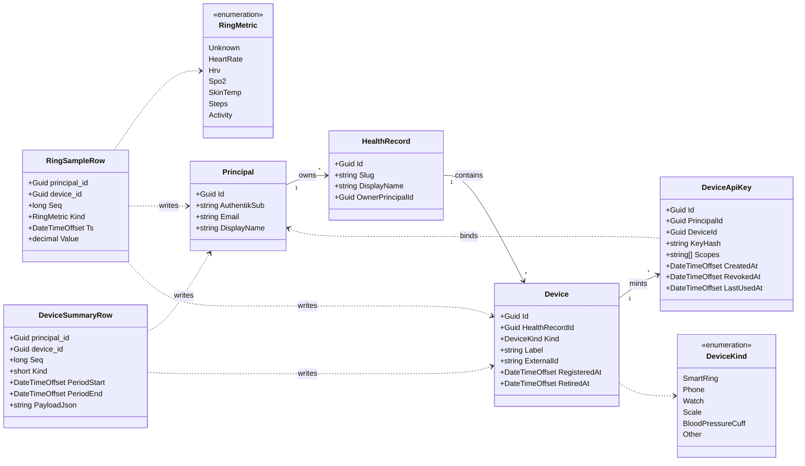

# Architecture

LupiraHealthApi is a single-owner personal health-vitals service: it ingests smart-ring telemetry from a
companion mobile app, stores it per person, and serves it back over an authenticated REST API. This document
describes the design as it is actually built — phase 1, no event sourcing, no sharing.

## Bounded context & layering

The solution is two projects with a hard dependency rule:

- **`LupiraHealthApi.Core`** — the bounded context. Domain types, application services, DTOs, mappers, and the
  data layer (Marten registrations + the raw telemetry schema). It has **no ASP.NET dependency**; Marten and
  Npgsql flow in transitively. This is where all behaviour and invariants live.
- **`LupiraHealthApi`** — a thin host. Minimal-API endpoint groups map routes → handlers → Core services, plus
  authentication, the result-to-HTTP mapping, OpenAPI/Scalar, health probes, and the schema-apply entry point.
  Handlers do transport only: read the authenticated identity, call a service, translate the result.

The project reference points host → Core and never the reverse, so transport concerns cannot leak into the
domain and the context is testable without a web server.

### Sibling-service boundary

This service owns **ring vitals + the health-record container + devices**. It deliberately does **not** own:

- **Location/presence** — a separate service with a different sharing model and different consumers.
- **Calendar, career, and other personal data** — their own services.

The only thing shared across these services is the **OIDC subject (`sub`)**. There is no shared database, no
shared schema, and no foreign keys across service boundaries; each service JIT-provisions its own local
principal keyed by `sub`. A ring registers as a device *here*; a phone registers as a device in the location
service. They are correlated only through the identity provider.

## Storage model — two models, one database

There is no event sourcing. Marten is used purely as a **document store**, and the high-frequency time-series
lives in **purpose-built relational tables**, in two schemas inside one Postgres database:

| Schema | Engine | Holds | Shape |
|---|---|---|---|
| `health` | Marten documents | `Principal`, `HealthRecord`, `Device`, `DeviceApiKey` | Discrete, mutable, low-volume state |
| `telemetry` | Raw Npgsql | `ring_sample`, `device_summary` | Append-only, high-volume time-series |

**Why no event sourcing.** Ring samples are append-only facts that are never edited or replayed — there is no
aggregate whose state is derived from a stream of events. Event sourcing would add a stream/projection
machinery that buys nothing here. The discrete state (records, devices, keys) is small and edited in place,
which is exactly what a document store models well. Marten's schema migration manages `health`; it never sees
or touches `telemetry`.

**Time-series tables.** `ring_sample` and `device_summary` are **native range-partitioned** by time (monthly).
Each row carries `(principal_id, device_id, kind, time, seq)` as its primary key. A background
`RingMaintenanceService` pre-provisions upcoming monthly partitions so ingest never blocks on DDL; partitions
are also created on demand at ingest time, so a late or backfilled batch always lands. The ingest window
rejects samples far in the future or older than the retention horizon (≈400 days).

## Identity & ownership

**Identity is JIT-provisioned.** On the first authenticated call, `PrincipalDirectory` resolves the caller to a
local `Principal`: it looks up by the durable OIDC `sub`, falling back to email, and creates the principal on
first sight. Email and display name are refreshed on subsequent logins; an email-only principal is upgraded in
place when a real `sub` first arrives. The local `Principal.Id` is **never shared** across services — `sub` is
the sole cross-service join key.

**Ownership is single-owner.** A `HealthRecord` belongs to exactly one principal via `OwnerPrincipalId`; every
`Device` hangs off a record via `HealthRecordId`; every telemetry row is stamped with its owning principal and
device. `AccessResolver` enforces ownership-only access — in phase 1, *read == write == owner*, with no
co-owner sharing. Authorization is by record ownership, resolved server-side; ids in a request body are never
trusted.

## Ingest trust model

The mobile uploader does **not** use OIDC. Device registration (`POST /devices`, an OIDC call) mints a
one-time credential `{keyId}.{secret}`:

- The secret is 256 bits of CSPRNG output, shown **once**; only its SHA-256 hash (`KeyHash`) is stored. The
  high entropy makes an unsalted hash safe.
- The key is bound to one `(principal, device)` pair and carries the `ingest` scope only.
- The uploader sends `Authorization: DeviceKey {keyId}.{secret}` on every ingest call (`IngestPolicy`).
  `DeviceKeyAuthHandler` parses and verifies it (constant-time compare) and attaches the principal + device.

The ingest handler **stamps the principal and device id onto every row from the verified key** — telemetry
never trusts ids in the payload. Batches are NDJSON, one record per line; each row carries a device-assigned
monotonic `seq` that is part of the primary key, and the merge is `ON CONFLICT DO NOTHING`. Retries and
overlapping re-uploads are therefore idempotent and free. Retiring a device (`DELETE /devices/{id}`)
stamps `RetiredAt` and revokes its keys, so the next ingest call with a revoked key returns `401`.

## Error handling & transport mapping

Application services return a transport-neutral `OpResult` / `OpResult<T>` carrying an `OpStatus`. The host maps
it to HTTP; the four error statuses render as RFC 7807 `application/problem+json`.

| `OpStatus` | HTTP | Body |
|---|---|---|
| `Ok` | 200 (or 204 for no-content, 202 for ingest) | value / none |
| `Invalid` | 400 | problem+json, title "Bad request" |
| `Forbidden` | 403 | problem+json, title "Forbidden" |
| `NotFound` | 404 | empty |
| `Conflict` | 409 | problem+json, title "Conflict" |

Each endpoint declares the exact subset of statuses it can return as a `Results<...>` union, so the OpenAPI
document advertises only the responses that endpoint actually produces.

## Domain model

All four `health` documents and the two `telemetry` row types are shown below. Fields marked nullable in code —
`DisplayName`, `Device.ExternalId`, `Device.RetiredAt`, `DeviceApiKey.RevokedAt`, `DeviceApiKey.LastUsedAt` —
are rendered as plain types in the diagram (Mermaid omits the `?`). On the telemetry rows, `principal_id` and
`device_id` are the server-stamped columns from the authenticated device key.

### Notes on the diagram

- **`Principal`** — `AuthentikSub` is the OIDC `sub` (the cross-service join key); `Email` is normalized
  lowercase and mutable. Stored as a Marten document indexed on `AuthentikSub` and `Email`.
- **`HealthRecord`** — `Slug` is a machine name (e.g. `personal`); `OwnerPrincipalId` is the single owner.
- **`Device`** — lifecycle is registered → retired (`RetiredAt`); `ExternalId` is an optional reference to an
  external system.
- **`DeviceApiKey`** — `Id` is the public `keyId`; only `KeyHash` is persisted; `Scopes` is fixed to
  `["ingest"]`; `RevokedAt` is set when the device is retired.
- **`RingSampleRow`** — one point-sample (`Value`) of a `RingMetric` at `Ts`. The ingest wire format accepts
  metric aliases (e.g. `hr` → `HeartRate`).
- **`DeviceSummaryRow`** — a device-computed summary over `[PeriodStart, PeriodEnd]`; `Kind` is a short
  discriminator and `PayloadJson` is the opaque device payload (stored as `jsonb`).

## Phase 2 (not built)

Clinical records (immunizations, health profile), co-owner sharing of a health record, and a consented bridge
to the calendar service. These are deferred; nothing in the current code depends on them.
